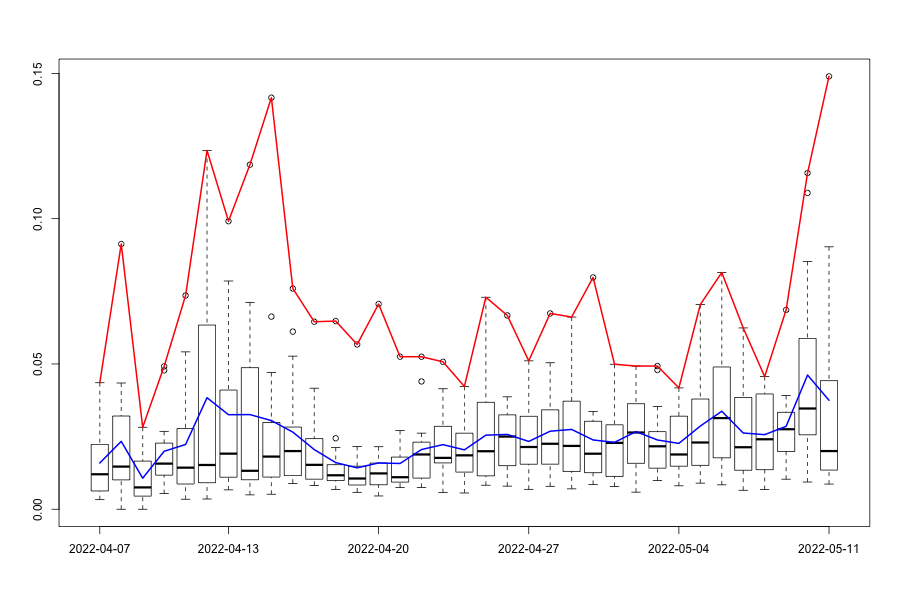
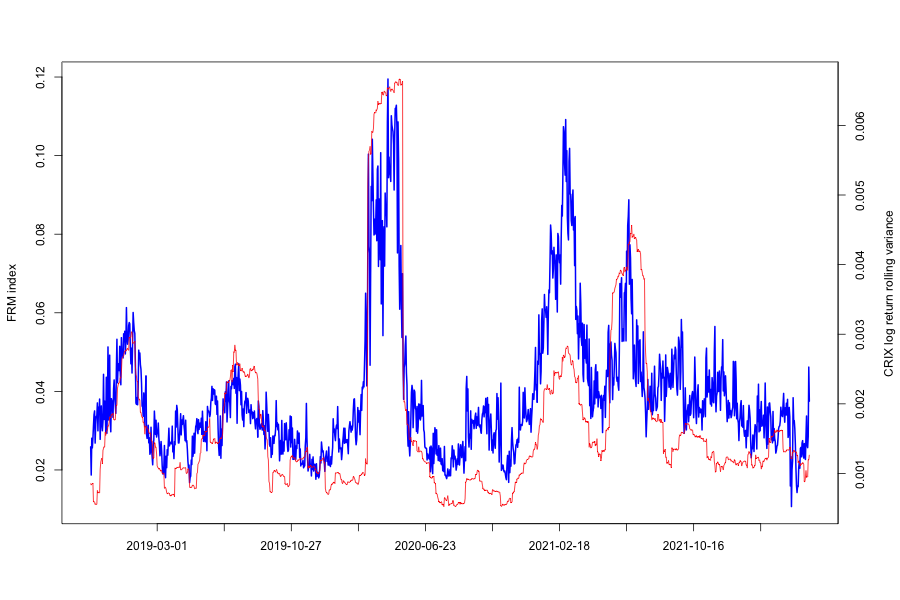
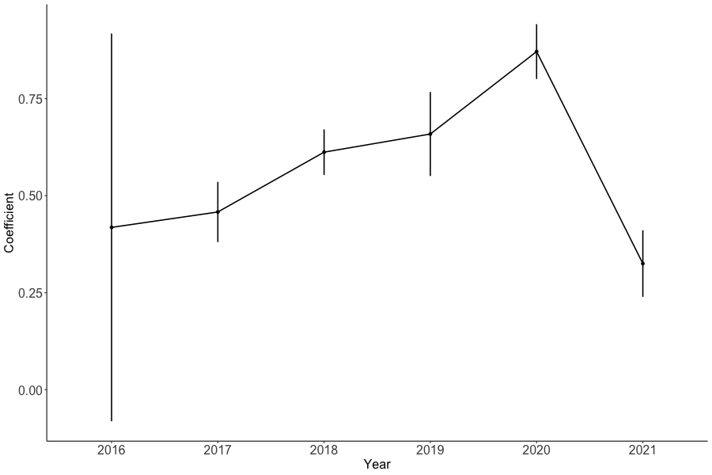
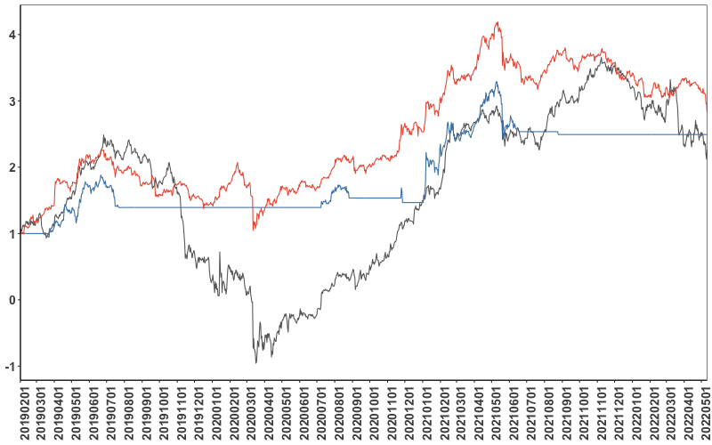

[](http://quantlet.de/)

## [](http://quantlet.de/) **FRM_Quantlet_Crypto** [](http://quantlet.de/)

```yaml


Name of Quantlet: FRM_Quantlet_Crypto
Published in: 'https://ida.ase.ro/financial-risk-meter/'
Description: 'Use FRM in Crypto and detect its prediction ability for future volatility'
Keywords: 'returns, linear, quantile, LASSO, L1-norm penalty, Crypto, Financial Risk Meter'
Author: 'Ruting Rainy WANG' 
Submitted:  '14.02.2024'
```







